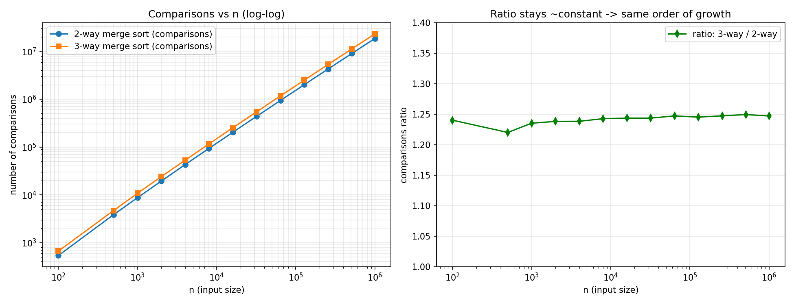

# Merge Sort vs. 3-Way Merge Sort

This program empirically compares the standard **2-way merge sort** against a
**modified 3-way merge sort** (divide into thirds, sort each third, merge
three sorted lists) by counting the number of key comparisons each performs
on random inputs of increasing size.

## Question

> Divide the input array into thirds instead of halves, recursively sort
> each third, and combine the results with a three-way merge. What is the
> worst-case running time?

## Answer

Both algorithms run in **Θ(n log n)** in the worst case.

- Standard merge sort: `T(n) = 2T(n/2) + O(n)` → `Θ(n log₂ n)`
- 3-way merge sort: `T(n) = 3T(n/3) + O(n)` → `Θ(n log₃ n)`

Since `log₃ n = log₂ n / log₂ 3`, the two expressions differ only by a
constant factor — the asymptotic order of growth is identical. The 3-way
version has a shallower recursion tree (`log₃ n` vs `log₂ n` levels), but
each merge step does more comparison work per element (finding the minimum
of 3 candidates instead of 2), so the constant factor doesn't improve overall.

## Files

| File | Description |
|---|---|
| `mergesort_compare.c` | C source implementing and benchmarking both algorithms |
| `results.csv` | Comparison counts generated by running the program (n from 100 to 1,000,000) |
| `mergesort_comparison.png` | Log-log plot of comparisons vs. n, and the ratio between the two algorithms |



## How it works

1. `mergeSort2` — standard 2-way merge sort (`merge2` merges two sorted halves).
2. `mergeSort3` — modified merge sort that splits the array into three
   (roughly) equal parts, recursively sorts each, and merges all three with
   `merge3`, which repeatedly picks the minimum of up to three front
   elements.
3. Instead of timing wall-clock performance (which is noisy and
   machine-dependent), the program counts **key comparisons** — a standard,
   machine-independent proxy for running time in comparison-based sorting.
4. For each input size `n` in `{100, 500, 1000, 2000, ..., 1000000}`, the
   program sorts the same random array with both algorithms and records the
   comparison counts, along with the theoretical `n log₂ n` and `n log₃ n`
   values for reference.
5. Results are written to `results.csv`.

## Build & run

```bash
gcc -O2 -o mergesort_compare mergesort_compare.c -lm
./mergesort_compare
```

This prints a summary table to the console and writes `results.csv`.

## Plotting the results

**With gnuplot** (command is also printed by the program):

```bash
gnuplot -persist -e "set datafile separator ','; set key top left; \
  set xlabel 'n'; set ylabel 'comparisons'; \
  plot 'results.csv' using 1:2 with linespoints title '2-way merge sort', \
       'results.csv' using 1:3 with linespoints title '3-way merge sort'"
```

**With Python/matplotlib:**

```python
import csv
import matplotlib.pyplot as plt

n, c2, c3 = [], [], []
with open("results.csv") as f:
    for row in csv.DictReader(f):
        n.append(int(row["n"]))
        c2.append(int(row["comparisons_2way"]))
        c3.append(int(row["comparisons_3way"]))

plt.plot(n, c2, 'o-', label="2-way merge sort")
plt.plot(n, c3, 's-', label="3-way merge sort")
plt.xscale("log"); plt.yscale("log")
plt.xlabel("n"); plt.ylabel("comparisons")
plt.legend(); plt.grid(True, which="both", alpha=0.3)
plt.show()
```

## Interpreting the results

On a log-log plot, both curves appear as straight, roughly parallel lines —
the signature of the same `Θ(n log n)` order of growth. The ratio of
3-way comparisons to 2-way comparisons stays close to a **constant**
(~1.24–1.25 in the sample run) across three orders of magnitude of `n`,
rather than trending up or down. A changing ratio would indicate a
different asymptotic complexity; a flat ratio confirms both algorithms
belong to the same complexity class, differing only by a constant factor.

| n | comparisons (2-way) | comparisons (3-way) | ratio |
|---|---|---|---|
| 1,000 | 8,714 | 10,764 | 1.235 |
| 100,000 | ~2.0M | ~2.5M | ~1.245 |
| 1,000,000 | 18,674,015 | 23,287,891 | 1.247 |

(See `results.csv` for the full data.)